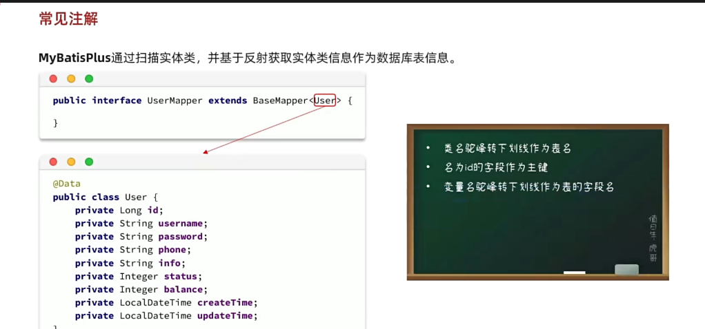
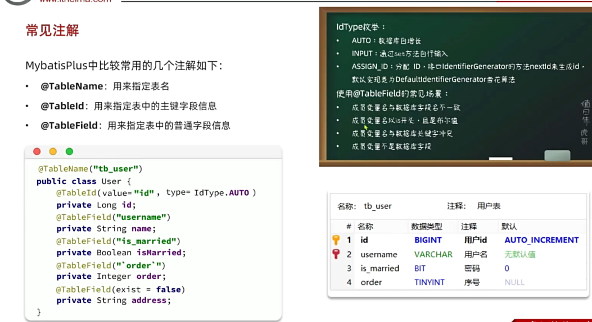
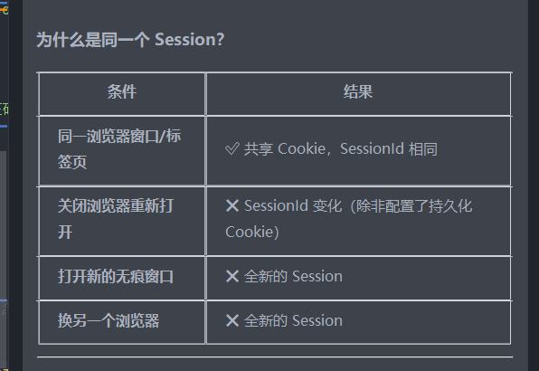
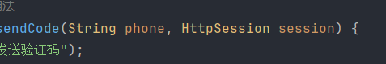
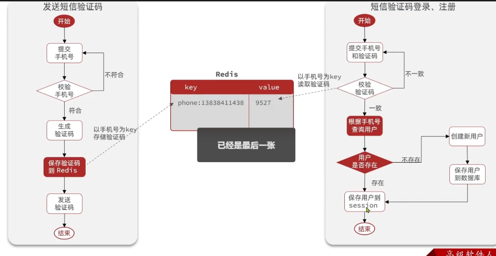
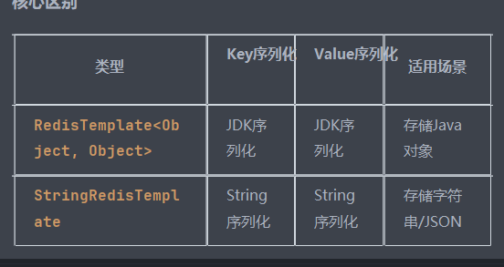
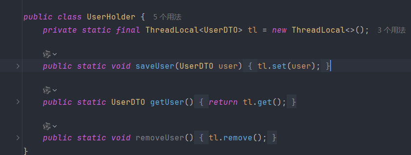
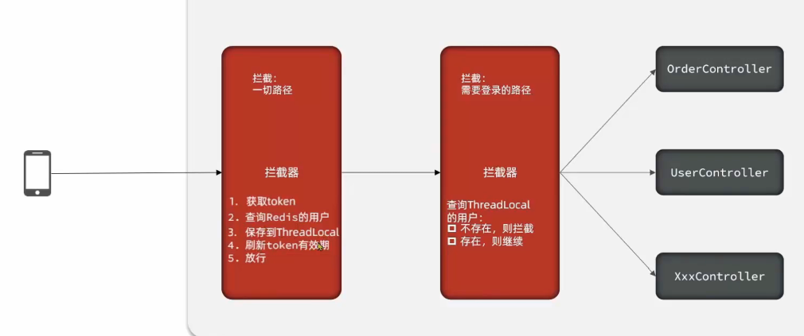

拉了下代码，推送到GitHub等等，虽然做了一个项目，但是有些步骤该不会的还是不会哈哈。。。

log,info和log.debug都可以打印在控制台

开发阶段：用 log.debug
能看到更多细节，方便调试
生产环境：用 log.info
只记录关键信息，性能更好

这段代码值得记录

        String code = RandomUtil.randomNumbers(6);
        session.setAttribute("code",code);}  键值对key value
RandomUtil来自hutool（外部依赖），说是一个好用的百宝箱

session
类比：
session = 超市寄存柜
sessionId = 取物条码
setAttribute = 往柜子里放东西
getAttribute = 从柜子里取东西

if (cacheCode == null || !cacheCode.toString().equals(code)
! 必须放在整个表达式前面，表示"否定这个条件"。
、

这句代码很重要、

        User user = query().eq("phone", phone).one();

涉及到mybatisplus，因为这个我去了解了一下mp，但还没细雪

mp的一些知识

ServiceImpl 提供了 query() 方法：
query() - 创建查询构造器
.eq("phone", phone) - 添加条件：phone = ?
.one() - 查询单条记录

public class UserServiceImpl extends ServiceImpl<UserMapper, User> implements IUserService 

继承了IService接口(藏在依赖中的jar包里)，ServiceImpl是它的实现类，
提供了很多通用的方法，比如query()，eq()，one()等等，可以直接使用，不需要自己写SQL语句，非常方便。

验证码和登陆信息存储在一个session中的原因

携带了当前的session参数进来

session是不能跨域的，所以手机电脑不能同时操作

线程不是对应接口，而是对应"一次请求"（一个用户的一次操作）。同一个接口可以被多个线程同时执行（多个用户同时访问），
同一个用户的不同接口请求也可能被不同线程处理。
ThreadLocal 正是利用"线程和请求绑定"这一特性，实现了请求级别的数据隔离。

用户发送请求，threadlocal就会给这个线程分配一个独立的内存空间，而且threadlocal里面存储了一些临时信息，比如用户id

session的一些问题

Session 是 Servlet 规范，不是 Tomcat 发明的

但默认实现完全依赖 Tomcat 内存

负载均衡下，单机 Session 会失效

所以现代架构都会把 Session 从 Tomcat 剥离，放到 Redis

redis和session存放验证码是不一样的

因为redis是共用的只有一个，所以key是唯一标识要不然获取不到

而session每次创建都是独立的，所以key可以重复，key可以直接取code

存放个人信息的token用随机数，因为前端每次请求都会拦截来获得携带的token，用别的比如手机可能会泄露

`redisTemplate.opsForValue().set("login_code:" + phone, code,2, TimeUnit.MINUTES);`
设置redis存储，2后面的为设置单位

点评项目里用的是stringRedisTemplate

本项目选择原因
查看项目代码,主要存储:
用户信息(JSON字符串)
验证码(String)
缓存标识(String)
都是字符串类型,所以用 StringRedisTemplate 更方便直观。

这段代码有点重要，保存信息到redis，涉及到token生成，存入数据，设置过期时间，返回token
`//保存用户到redis
String token = UUID.randomUUID().toString();
String tokenKey = "login_token:" + token;
//因为putall需要map集合，所以需要转换
Map<String, Object> userMap = BeanUtil.beanToMap(userDTO);
stringRedisTemplate.opsForHash().putAll(tokenKey,userMap);
stringRedisTemplate.expire(tokenKey,30,TimeUnit.DAYS);
//前端规定返回token
return Result.ok(token);`

我刚刚明明登陆了点击主页却仍然让我跳转登陆，我疑惑不解

原因是登陆其实感觉只是生成一个token，然后保存到redis，接着去访问没有被放行的接口的时候，就要进行token验证

而我刚刚却没有完成me这个接口的方法，所以没有成功而是让我跳转登陆

保存用户信息到threadlocal是放在拦截里面，保存信息方便后续使用
//4.保存用户信息到ThreadLocal
UserHolder.saveUser(userDTO);

这个holder里面
是由threadlocal实现的

为什么要注册拦截器？
核心原因：Spring容器管理 ≠ 自动生效

要告诉他什么时候执行，执行顺序等，所以配置了一定要记得注册

token刷新也是放在拦截器里面，只要验证通过了就会刷新token时间

考虑到用户登陆了也会访问不需要拦截的路径，所以新设置一个拦截器拦截所有路径去专门刷新token，而之前那个拦截器只是做一个拦截登陆

从threadlocal查询是否存在该用户即可

设置拦截器的顺序用order，从0开始，越小越先执行，加在代码最后面
