 Iservice是mp提供的，一系列封装了三十多个crud方法
 
redis存储的是string类型json格式，所以格式也要设置正确，不然无法序列化

`stringRedisTemplate.opsForValue().set("cache:shop:" + id, JSONUtil.toJsonStr(shop));`

这段代码，设置key，value。后者不能单纯tostring，因为tostring只是把对象转为字符串，还要转为json字符串

查询出来的时候也如此，查询的时候是这个json字符串，返回要转成对象再返回

**Shop shop = JSONUtil.toBean(shopJson, Shop.class);**
注意这个Shop.class是大写的，表示一个类

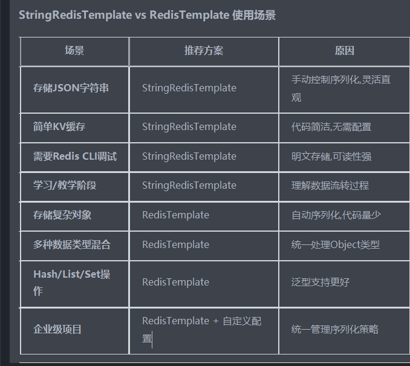
两种对比

redistemplate和stringredistemplate都没有进行配置直接使用的，因为导入了依赖，所以用的都是默认配置

如果直接使用前者，会因为没有配置序列化而看不懂
 
苍穹外卖项目里面自己配置了

缓存更新选择的最佳方案
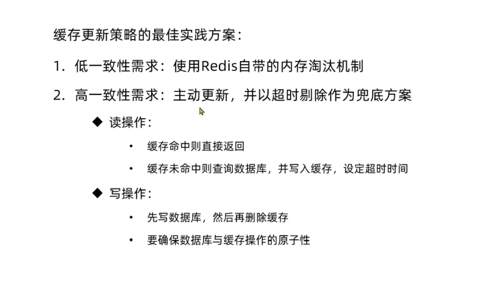

本项目好像没有管理端，得使用测试工具

**缓存穿透**
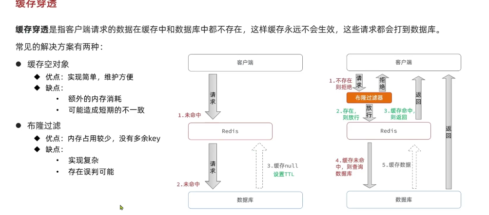

采用第一种缓存null值的方法

无非就是增加两个步骤

在第一次没有在数据库查到数据时，给redis缓存一个空字符串

然后在查询redis里是否有数据时，判断如果等于空字符串，也返回错误信息

除此之外，还有一些防止缓存穿透的方案

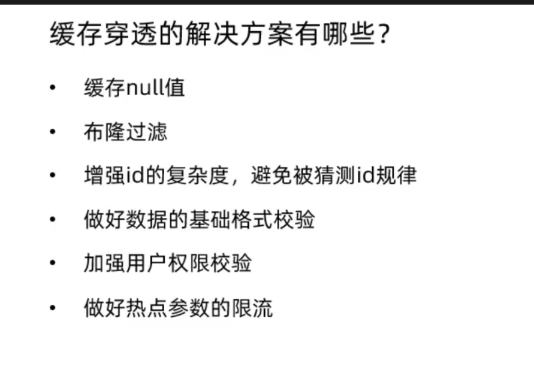

redis原来是这样的，只要第一个用户查询数据库然后缓存数据到了redis，后面的用户都是在redis里面查，只要没失效

缓存雪崩，第二个方式是设置哨兵，当第一个redis崩了启动第二个，所谓集群
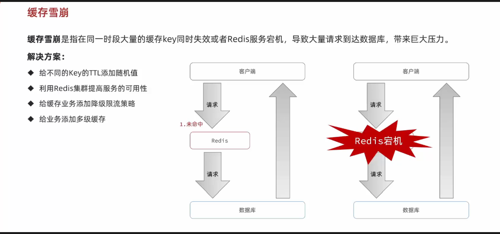

缓存击穿
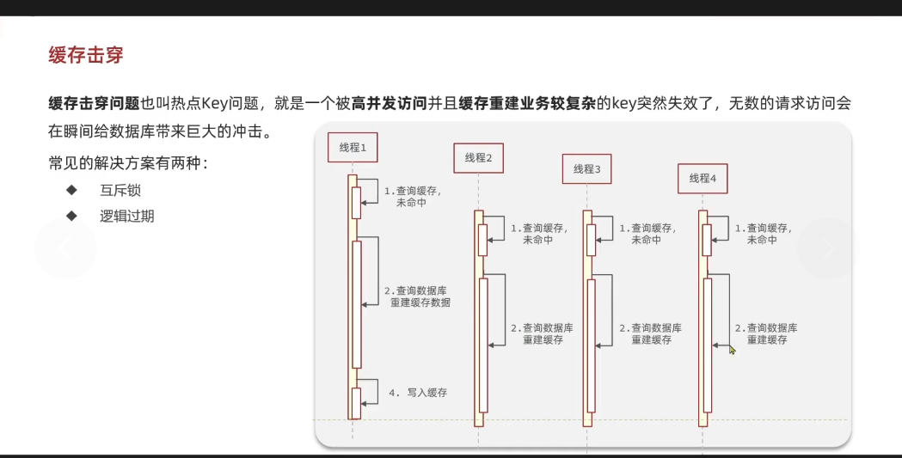
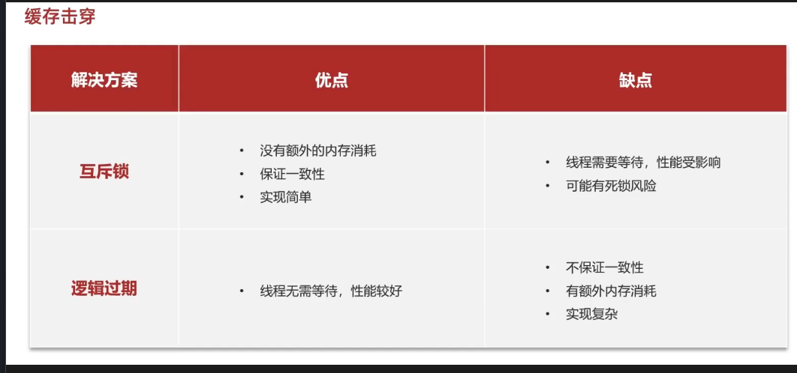

两种方案都可以，一个保持一致性，一个可用性高

具体情境具体选择

第一种方式无非就是设置一个锁（redis中的setnx 当key不存在才会设置value，所以有key就不会

然后把锁加在查询数据库前，别的用户请求不到时休眠，休眠后再重试

获取锁的话就查询数据库

第二种方案更复杂

一般是针对热点key，而且会进行缓存预热，保证用户第一次就查redis而不是数据库

还有重要的就是他不设置ttl，之所以叫逻辑，是因为他加了一个时间属性到类里面

如果这个时间属性过期，他不会删除数据，而是返回旧数据再用线程池开一个新线程来查询数据库并写到数据库
这期间也要用互斥锁避免多个线程同时查询数据库。

util封装redis类

为什么工具类不能直接查数据库？不能用mp？

因为他没有继承，而我们之前用的shop继承了
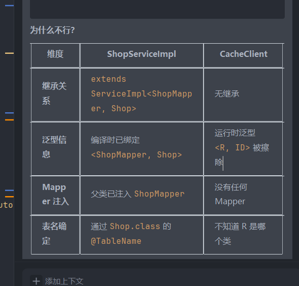

所以只能传入一个函数结果，这个叫函数编程

解决这个this是什么，他怎么就知道查哪张表
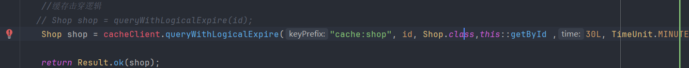
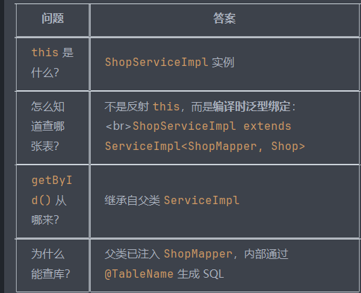

所以后续应该就是使用这个工具类来解决击穿和穿透问题了，注意传值，还有这个工具类所用的泛型思想很重要

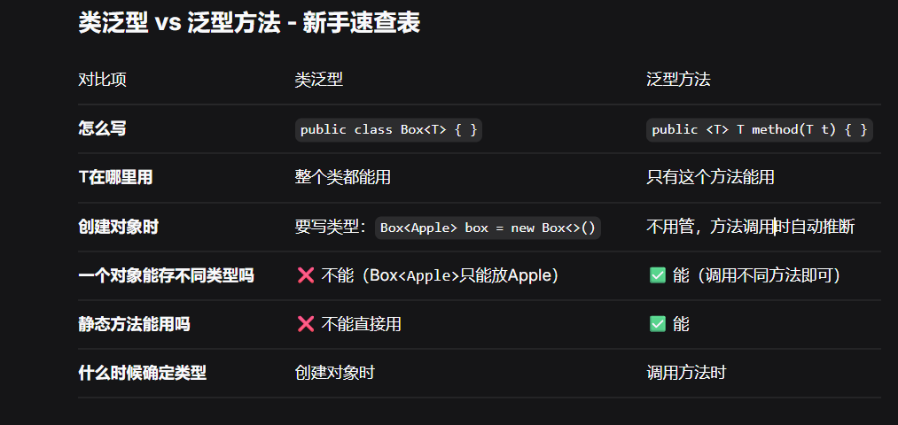

