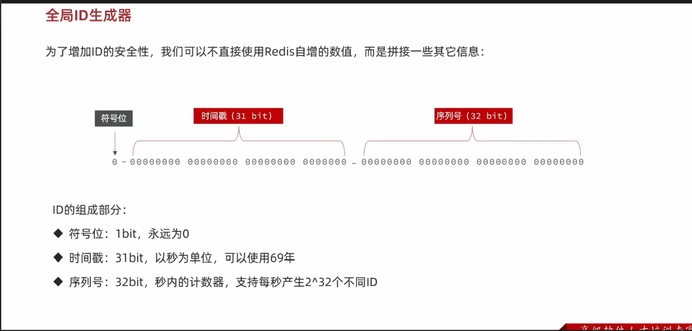
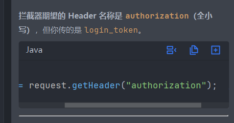
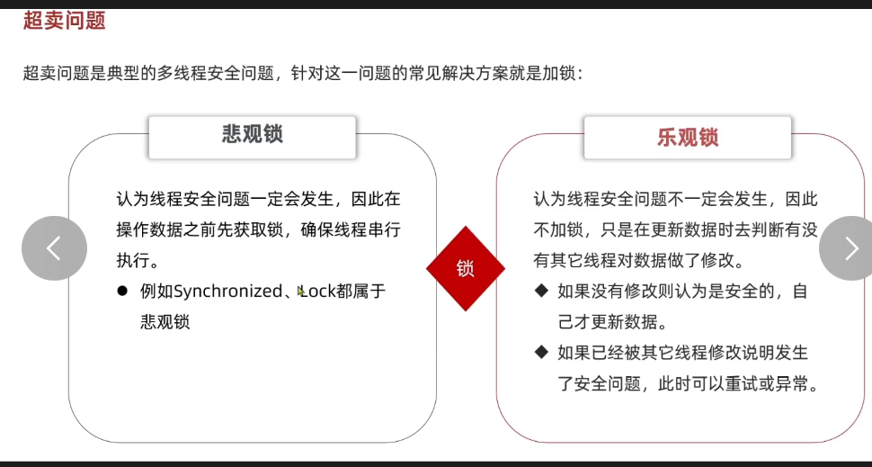
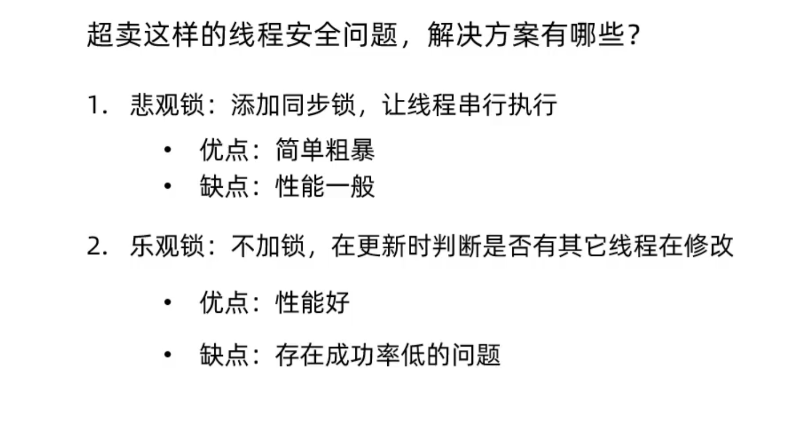
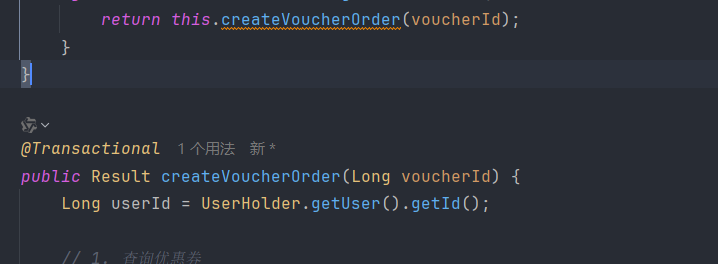
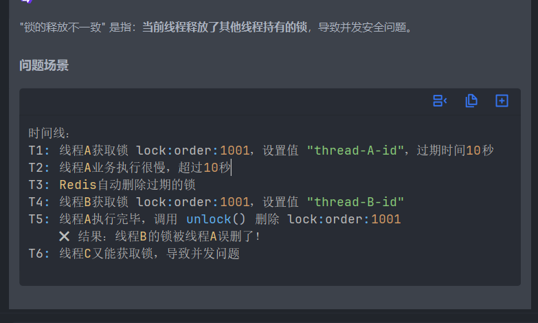
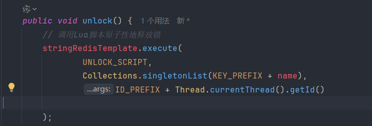
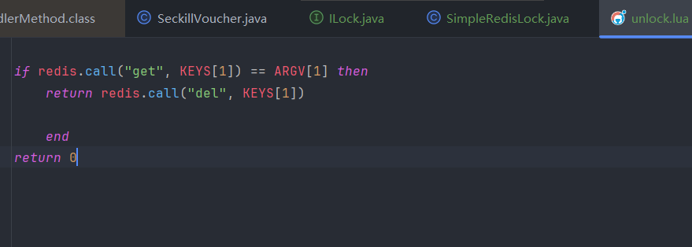

 
 
全局id生成器，可以生成难以找到规律的id以免数据泄露
时间戳和前缀拼接起来再放在redis里面调用自增长的功能

测试的时候用的不是logintoken

这是行业标准

login_token只是我存到redis的一个名字罢了

悲观锁与乐观锁

项目里面两个都用到了，悲观锁解决用户只能买一单的问题，悲观锁锁定对象，用到了常量池判断是否是当前用户id
而且将锁加在方法外面，可以实现先提交数据在释放锁，提高数据一致性

乐观锁解决了用户并发的问题
乐观锁的话不是真的加锁，只是在写入数据库前再查一次数据库，判断订单是否有更改或是否还满足条件

这里有个代理对象的问题，spring是通过代理对象对注解什么的生效

因为注解等是由代理对象创建的，而调用方法这里返回的是当前类下的对象，所以要让他走代理对象

何为分布式锁

就是多个服务器同时操作同一数据，防止数据不一致，简单点说多个服务器共用一把锁

而刚刚实现的synolize什么的锁只能锁单个服务器

锁释放的不一致性

所以要加个判断当前线程的锁是不是redis里面存储的锁，如果不是则无法释放

如果判断成功是同一个锁后但是进程突然阻塞导致没有手动放锁，但是redis里面过期了
另一个线程就会拿到锁，然后并发一系列问题

这个就是释放和判断的不一致性

可以利用lua脚本解决，lua脚本可以保证原子性
先编写一个放锁的方法，然后在另一个文件编写一个lua语句，再在这个方法里面调用lua语句即可

后面就是redisson了