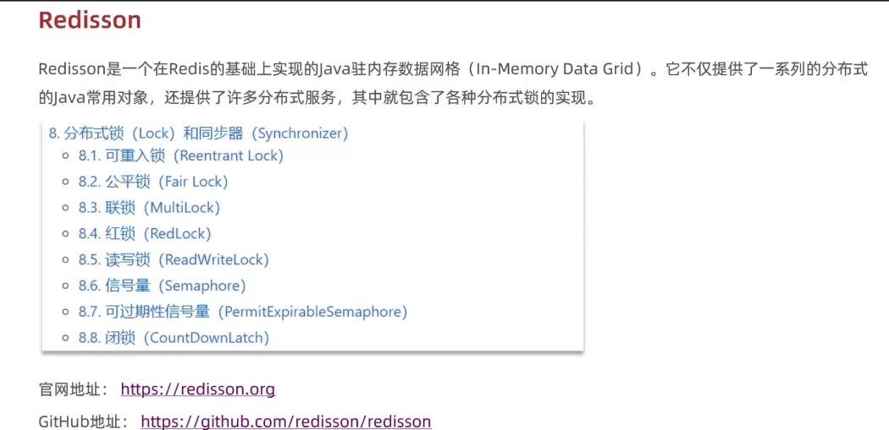
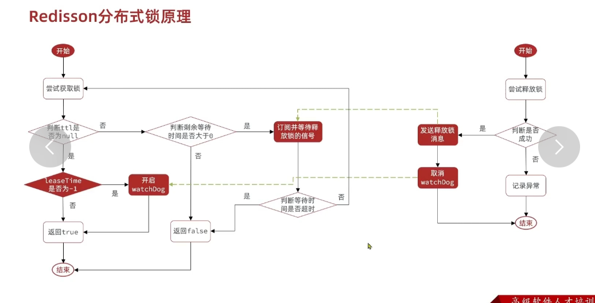
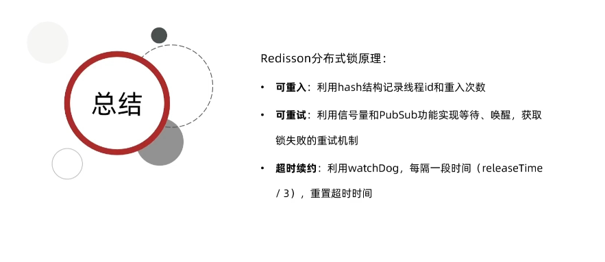
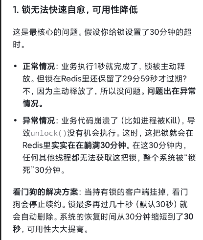
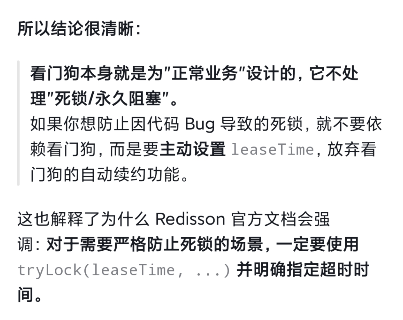
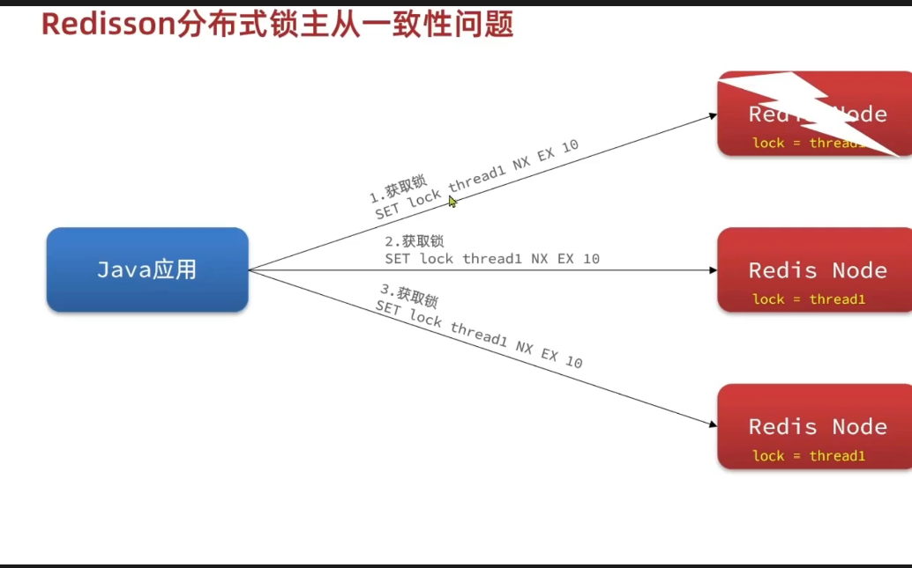
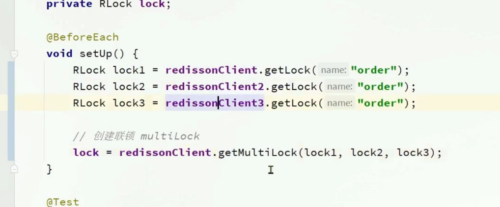
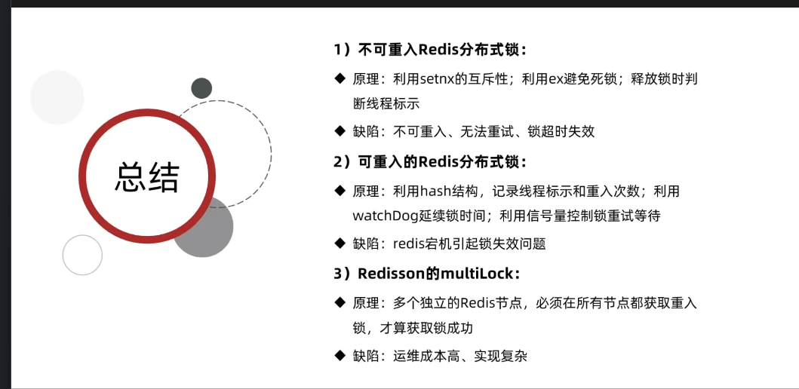
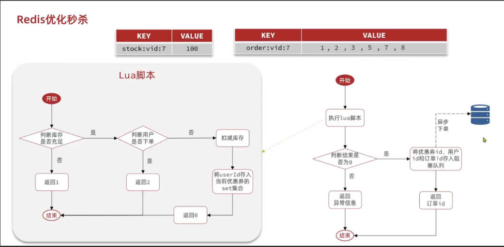

说是企业都用redisson，不用自己设计锁，那前面算是白雪了吗哈哈，懂点原理还是好的

`@Configuration
public class RedissonConfig {
@Bean
public RedissonClient redissonClient() {
Config config = new Config();
config.useSingleServer().setAddress("redis://127.0.0.1:6379");
return Redisson.create(config);
}
}`

我好像又更加理解配置类一点了，配置类一般都是导入依赖后引入的第三方的东西对吧。

使用一个单独的配置类加上bean注解，交给spring管理，就是为了能让别的类能够直接注入。

而且配置的意思就是在这里写好配置逻辑，就不用每次调用都配置了，而且修改只要在这一个地方修改

redisson基本都是可重入锁，之前的不是

所谓可重入锁，就是当一个业务调用另一个业务的方法时，也需要用到锁，
如果是前面的情况，那就会发生死锁

如果是可重入锁的话，采用的是hash结构，有俩value，加了一个锁的计数器
他不仅会判断是否是同一把锁，如果是计数器加1,而不是之前是同一把锁就失败，如果不是获取锁失败
释放的时候也是，减1，如果减到0，则释放锁，不是0的话，说明不是最终业务，还要重置有效期继续执行业务

redisson分布式锁原理

不设置leasttime就默认使用看门狗

看门狗的逻辑是业务不结束永不过期，你为什么不设置一个很大的时间？

下面是multiLock，解决单个redis服务器宕机的问题

只要有一个服务器没正确获取到锁，这个请求就不会成立，保证了在一个redis服务器宕机时引起的不一致问题

使用方法，类选择multilock

总结三种方式

redis中全局不能有一样的key，set集合可以保证value不重复

我之前做的shop场景是在数据库里面操作，先查库存，然后判断库存，再对库存操作。毫无疑问对数据库压力极大，性能低

所以用redis解决

我刚刚有个问题，我之前不是用了redis锁解决一人一单问题吗？

但不是，我只是解决了并发情况下的误差处理，查询一人一单的情况还是查的mysql，后续直接用redis的set集合解决，因为value不能重复

如果锁过期了而没判断一人一单，他就又可以下单了啊

    private static final DefaultRedisScript<Long> SECKILL_SCRIPT;

    static {
        SECKILL_SCRIPT = new DefaultRedisScript<>();
        SECKILL_SCRIPT.setLocation(new ClassPathResource("seckill.lua"));
        SECKILL_SCRIPT.setResultType(Long.class);
    }
    @Override
    public Result seckillVoucher(Long voucherId) {
            Long userId = UserHolder.getUser().getId();
            Long result = stringRedisTemplate.execute(
                    SECKILL_SCRIPT,
                    Collections.emptyList(),
                    voucherId.toString(),
                    userId.toString()
            );

调用lua脚本的代码，定义，代码块初始化，调用excute方法并传入他需要的参数

    private BlockingQueue<VoucherOrder> orderTasks = new ArrayBlockingQueue<>(1024 * 1024);
    private ExecutorService SECKILL_ORDER_EXECUTOR = Executors.newSingleThreadExecutor();

    @PostConstruct
    private void init() {
        SECKILL_ORDER_EXECUTOR.submit(() -> {
            while (true) {
                try {
                    VoucherOrder voucherOrder = orderTasks.take();
                    handleVoucherOrder(voucherOrder);
                } catch (Exception e) {
                    e.printStackTrace();
                }

这段代码很有意思，首先是一个阻塞队列的使用，第一次用。

然后是线程池的使用。  @PostConstruct表示在运行项目后自动执行该方法,

无非就是调用一个新的进程来操作

很像一个餐厅，一个人负责前台招待客人，一个负责后厨，前台判断有无下单资格
客人下单后给客人返回一个订单号，后厨也会根据阻塞队列来炒菜对吧

现在使用的阻塞队列是使用的内存，可能会溢出，而且断电宕机等事故的话，会消失

