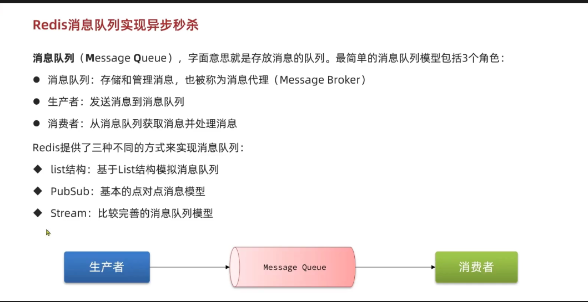
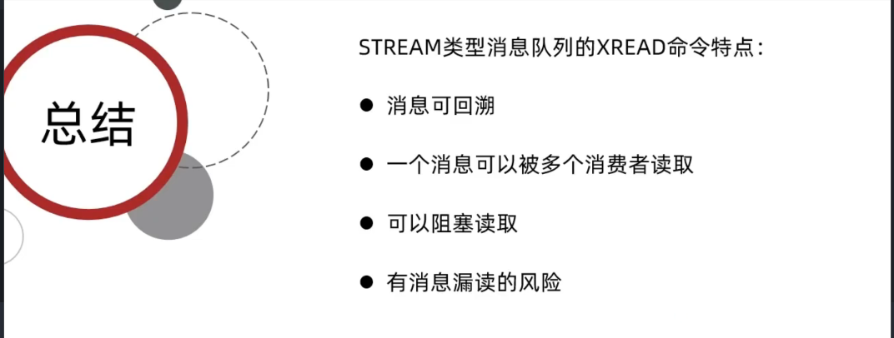
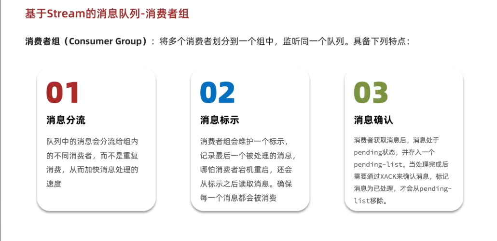
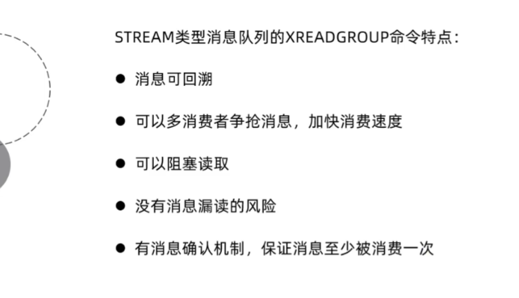
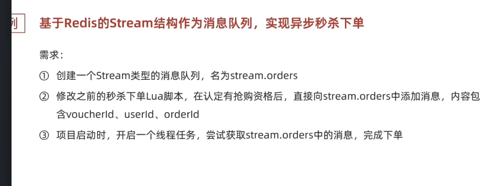

Redis消息队列的认识

主要的方式是stream类型队列

基于基本的升级为stream组

组的特点

流程stream改善代码

在lua脚本里创建消息队列，首次add没有队列就会自动创建

`redis.call('xadd', stream.orders, '*', 'userId', userId, 'voucherId', voucherId, 'Id', orderId)`

然后主要流程就是从消息队列读取消息了

        SECKILL_ORDER_EXECUTOR.submit(() -> {
            while (true) {
                try {
                    List<MapRecord<String, Object, Object>> records = stringRedisTemplate.opsForStream().read(
                            Consumer.from(GROUP_NAME, CONSUMER_NAME),
                            StreamReadOptions.empty().count(1).block(Duration.ofSeconds(2)),
                            //消息队列的名字和读取位置
                            StreamOffset.create(STREAM_NAME, ReadOffset.lastConsumed())
                    );

                    if (records == null || records.isEmpty()) {
                        continue;
                    }

                    MapRecord<String, Object, Object> record = records.get(0);
                    Map<Object, Object> values = record.getValue();

                    VoucherOrder voucherOrder = new VoucherOrder();
                    voucherOrder.setId(Long.valueOf(values.get("orderId").toString()));
                    voucherOrder.setUserId(Long.valueOf(values.get("userId").toString()));
                    voucherOrder.setVoucherId(Long.valueOf(values.get("voucherId").toString()));

                    handleVoucherOrder(voucherOrder);

                    //确认消息ACK
                    stringRedisTemplate.opsForStream().acknowledge(STREAM_NAME, GROUP_NAME, record.getId());

无非就是确定消息队列是怎么读的，去哪读

然后从队列里获取数据，获取到用这个数据转成对象然后传给创建订单方法去完成数据库操作

最后还要确认消息，要是有异常的话得调用另一个复杂方法

private void handlePendingMessages() {
try {
List<MapRecord<String, Object, Object>> pendingRecords = stringRedisTemplate.opsForStream().read(
Consumer.from(GROUP_NAME, CONSUMER_NAME),
StreamReadOptions.empty().count(1),
StreamOffset.create(STREAM_NAME, ReadOffset.from("0"))
);

            if (pendingRecords != null && !pendingRecords.isEmpty()) {
                MapRecord<String, Object, Object> record = pendingRecords.get(0);
                Map<Object, Object> values = record.getValue();

                VoucherOrder voucherOrder = new VoucherOrder();
                voucherOrder.setId(Long.valueOf(values.get("orderId").toString()));
                voucherOrder.setUserId(Long.valueOf(values.get("userId").toString()));
                voucherOrder.setVoucherId(Long.valueOf(values.get("voucherId").toString()));

                handleVoucherOrder(voucherOrder);
                stringRedisTemplate.opsForStream().acknowledge(STREAM_NAME, GROUP_NAME, record.getId());
            }
        } catch (Exception e) {
            log.error("处理Pending消息异常", e);
        }
    }

就是从pendinglist获取数据，然后把这个数据传过去进行上面那里处理

然后就是给新篇章开了一个头了。看了达人探店功能

