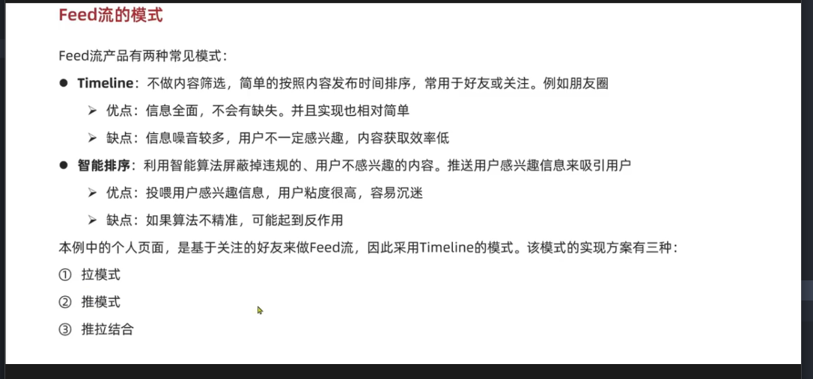
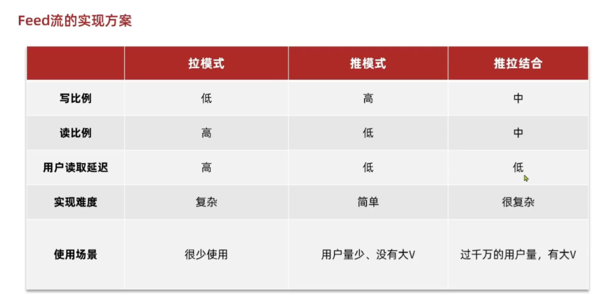
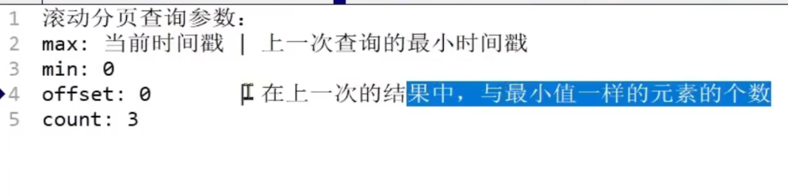

        Long userId = blog.getUserId();
        User user = userService.getById(userId);

我现在是在blog类里面想要根据blog的userid去查user类

所以mp的话肯定要用到userservice去查对吧，所以要注入

把set改为zset后

        Double score = stringRedisTemplate.opsForZSet().score(key, userId.toString());

判断是否存在从ismemebr变成了查是否有分数

传值的时候多传一个参数score，时间的话就是时间戳

        blogVo.setIsLike(score!=null);
这代码困扰了我，其实这个字段是布尔类型

如果括号里参数满足，则设置true，如果不满足反之

总之上午就完成了一些功能的开发吧，主要就是用到zset集合，比如展示用列表range排序reverserange逆向排序

        return Result.ok(count > 0);
大于0传true，小于0是false、

count > 0 是一个比较表达式，会计算出布尔结果
如果 count = 1，则 1 > 0 → true
如果 count = 0，则 0 > 0 → false
Result.ok() 接收这个布尔值并封装返回

stringRedisTemplate.opsForSet().intersect(key1, key2);

intersect可以获取集合的交集，故而可以获得共同的东西

        List<UserDTO> users = intersect.stream()
                .map(id -> {
                    User user = userService.getById(Long.valueOf(id));
                    return BeanUtil.copyProperties(user, UserDTO.class);
                })
                .collect(Collectors.toList());

这段stream流代码，map是中间操作，转换的作用。collect是终止操作，将流转换为集合

进入feed流，推送相关的功能

本项目使用推模式

因为用户数小于千万级别的都不算大

用户的收信箱基于redis实现，符合根据时间戳排序，分页查询使用zset集合，可以实现滚动翻页

但滚动分页好像只能一页一页访问，他是获取上一页的时间戳的最小值，然后下一页第一条是比这个时间戳更小一点的，所以不能跳转页面

滚动分页的参数

List<Blog> blogs = query().in("id", ids).last("ORDER BY FIELD(id," + idStr + ")").list();
这段sql语句使用了ORDER BY FIELD实现精准控序，因为in传过来的是无序的

实现滚动分页无非就是利用上一轮传过来的时间戳和offset查到的这一轮的集合中获取最小时间戳，offset，和集合列表传回去

那个利用ids查到的只是博客的信息，还要针对每条博客查他的用户信息和点赞

