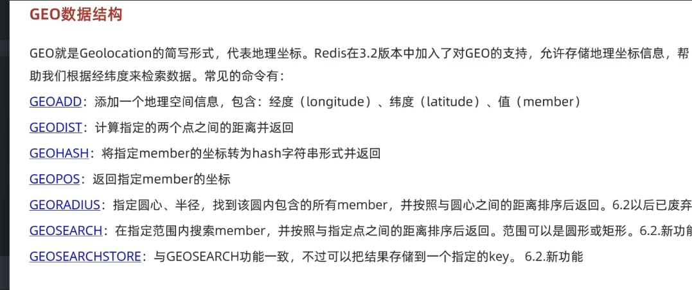
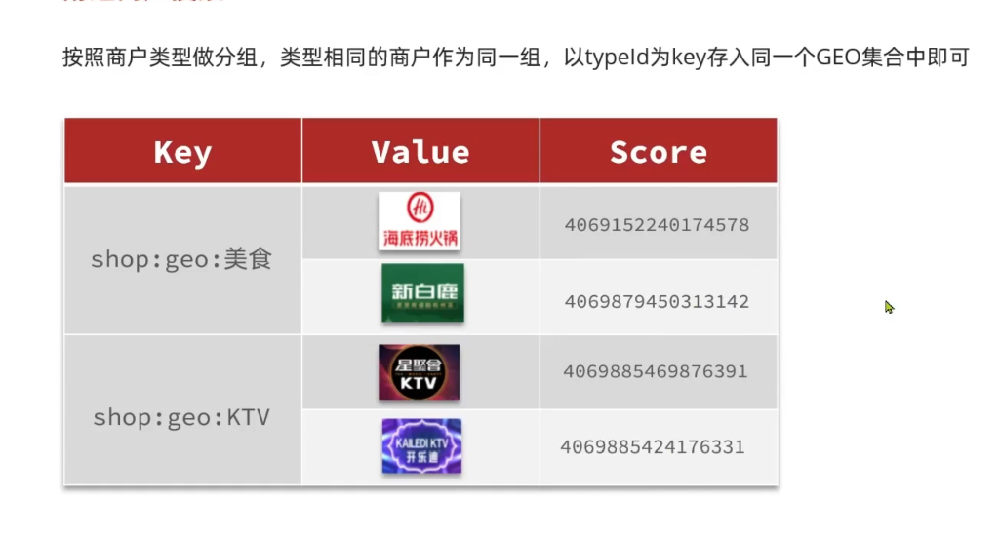
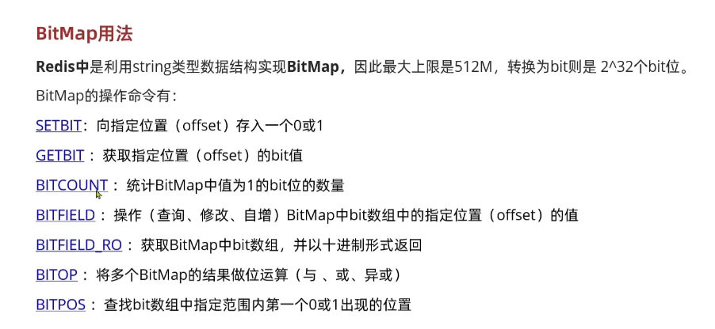
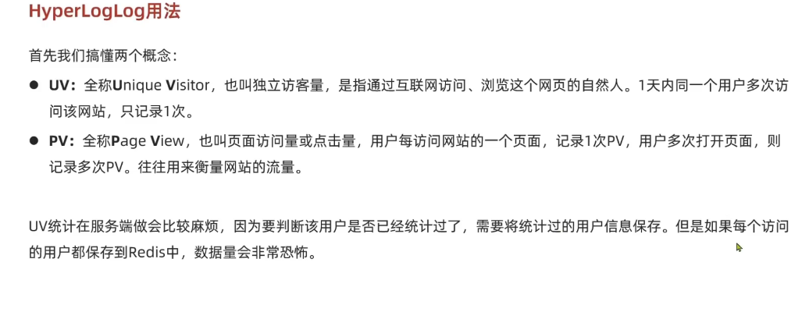
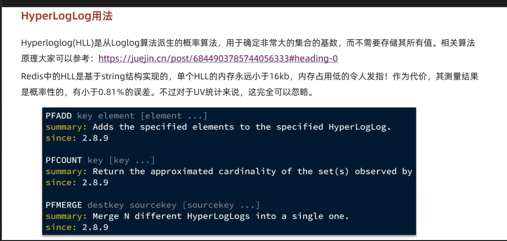

GEO 操作地理位置

实现附近功能的数据结构

`// 3.查询redis、按照距离排序、分页。结果：shopId、distance
String key = SHOP_GEO_KEY + typeId;
GeoResults<RedisGeoCommands.GeoLocation<String>> results = stringRedisTemplate.opsForGeo()
.search(
key,
GeoReference.fromCoordinate(x, y),  // 用户当前位置作为参考点
new Distance(5000),                 // 搜索半径5000米
RedisGeoCommands.GeoSearchCommandArgs.newGeoSearchArgs()
.includeDistance()              // ← 关键：要求返回距离
.limit(end)
);`

当执行 .search() 方法时：

Java客户端将命令发送到Redis服务器

Redis服务器内部对每个店铺位置执行Haversine公式计算

计算每个店铺到参考点 (x, y) 的距离

自动按距离从小到大排序

`int from = (current - 1) * SystemConstants.DEFAULT_PAGE_SIZE;
int end = current * SystemConstants.DEFAULT_PAGE_SIZE;`

from：起始索引（跳过的数量）di

end：结束索引（查询总数）

例如：current=2（第二页），每页10条 → from=10, end=20

注意：这里会查询前20条，但只返回第11-20条

`
list.stream().skip(from).forEach(result -> {`

list.stream()：将列表转换为流

.skip(from)：跳过前 from 条数据，实现分页效果

例如：from = 20，则跳过前20条，从第21条开始处理

.forEach()：对跳过后剩余的每条数据执行处理

功能流程

参数校验 → 分页计算 → Redis查询(距离+排序) → 分页截取 → MySQL查询详情 → 返回结果

签到功能，用户每天都可以签到对吧，而且用户很多的话，数据太多了，如果拿数据库来装，数据非常庞大

所以用redis的bitmap来实现签到功能，他用的是string的key value，key就是用户id加这个月的时间戳，value就是这个用户这个月签到情况，1表示签到，0表示未签到

他使用的是一个31位的二进制数来表示这个用户这个月签到情况

看这个签到功能的时候我有两个疑问

第一个是while循环 
如果全是1 ， 如何跳出循环？

因为是1他要右移，就算算满一月是31天，而int32位，long64位，最后一位一定是0可以跳出循环

第二个是十进制的问题

他返回的是十进制是没问题，十进制可以直接做与运算，不用转为二进制

何为UV与PV

统计UV的实现

